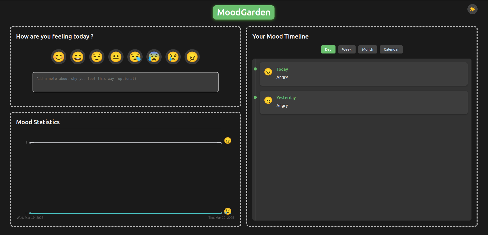
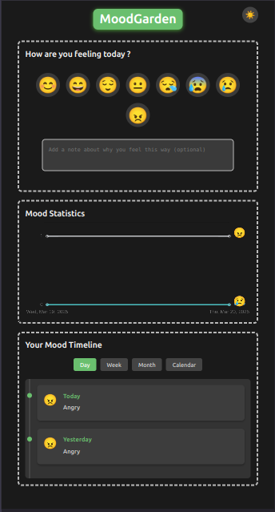

# ✨ MoodGarden

A beautiful, intuitive web application for tracking your daily moods and visualizing emotional patterns over time. MoodGarden helps you gain insights into your emotional well-being through elegant visualizations and easy mood logging.

## 🌟 Features

- **One-Click Mood Logging**: Select from 8 different mood emojis to quickly record how you're feeling
- **Personal Context**: Add optional notes to provide context for your mood entries
- **Multiple Visualization Views**:
  - **Day View**: Chronological timeline of all mood entries with the most recent at the top
  - **Week View**: Weekly mood patterns with frequency statistics
  - **Month View**: Monthly mood distribution and trends
  - **Calendar View**: Traditional calendar visualization with color-coded mood indicators
- **Interactive Chart**: Dynamic chart displaying your mood trends with emoji indicators
- **Light/Dark Theme**: Toggle between themes with a single click, with automatic system preference detection
- **Responsive Design**: Seamlessly works across desktop, tablet, and mobile devices
- **Local Data Storage**: All your mood data is securely stored in your browser's localStorage
- **Modern Typography**: Optimized fonts with smooth rendering for enhanced readability
- **Intuitive Interface**: Clean layout with left and right panels for optimal information organization
- **Visual Tooltips**: Hover over emojis to see detailed mood descriptions

## 📷 Screenshots





## 🚀 Live Demo

Experience MoodGarden: [https://moodgarden.vercel.app/](https://moodgarden.vercel.app/)

## 🔍 How It Works

### Core Functionality

1. **Select a Mood**: Click on an emoji that best represents your current emotional state
2. **Add Context** (optional): Enter notes about what influenced your mood
3. **View Your History**: Switch between different visualization methods to track patterns
4. **Analyze Trends**: Use the statistics chart to identify emotional patterns over time

### Data Structure

MoodGarden stores each mood entry as an object with:
- Date (YYYY-MM-DD format)
- Mood name (Happy, Sad, Excited, etc.)
- Emoji representation
- Optional user note
- Timestamp for precise ordering

## 💻 Technologies Used

- **HTML5**: Semantic structure and accessibility
- **CSS3**: 
  - CSS Variables for theming
  - Flexbox and Grid for responsive layout
  - Animations and transitions for UI enhancements
  - Modern typography with Google Fonts
- **JavaScript**: 
  - DOM manipulation for dynamic content
  - LocalStorage API for data persistence
  - Date manipulation and formatting
  - Chart.js for data visualization
- **Web Fonts**: Google Fonts integration for typography
- **Font Smoothing**: Enhanced text rendering across devices

## 🔧 Installation

1. Clone the repository:
   ```
   git clone https://github.com/dharmendra9503/MoodGarden.git
   ```

2. Navigate to the project directory:
   ```
   cd MoodGarden
   ```

3. Open `index.html` in your browser or use a local development server.

## 📱 Usage Guide

1. **Log Your Mood**:
   - Select an emoji that represents your current mood
   - Optionally add a note to provide context
   - Your mood is automatically saved

2. **View Your Moods**:
   - Use the view buttons to switch between Day, Week, Month, and Calendar views
   - Scroll through your mood history in timeline view
   - See mood distribution in week and month views

3. **Navigate Calendar**:
   - Use the arrow buttons to move between months
   - Click on days with emoji indicators to see detailed mood information

4. **Change Theme**:
   - Click the sun/moon icon to toggle between light and dark themes
   - Your preference is saved for future visits

5. **Analyze Trends**:
   - Review the mood chart to identify patterns in your emotional state
   - Hover over chart elements to see detailed information

## 🔮 Future Enhancements

- **Data Export**: Export your mood history as CSV or JSON
- **Insights Engine**: AI-powered analysis of your mood patterns with recommendations
- **Custom Categories**: Create your own mood categories with custom emojis
- **Reminder System**: Get notifications to log your mood
- **Cloud Sync**: Synchronize your mood data across devices
- **Advanced Analytics**: More detailed statistical breakdowns
- **Social Sharing**: Share mood insights with friends or healthcare providers
- **Font size adjustments**: For better accessibility

## 🤝 Contributing

Contributions are welcome! Please feel free to submit a Pull Request.

1. Fork the repository
2. Create your feature branch (`git checkout -b feature/AmazingFeature`)
3. Commit your changes (`git commit -m 'Add some AmazingFeature'`)
4. Push to the branch (`git push origin feature/AmazingFeature`)
5. Open a Pull Request


## 👏 Acknowledgements

- Emoji designs used for mood representation
- Chart.js library for data visualization
- Google Fonts for typography enhancement

---

Made with ❤️ for better emotional awareness 